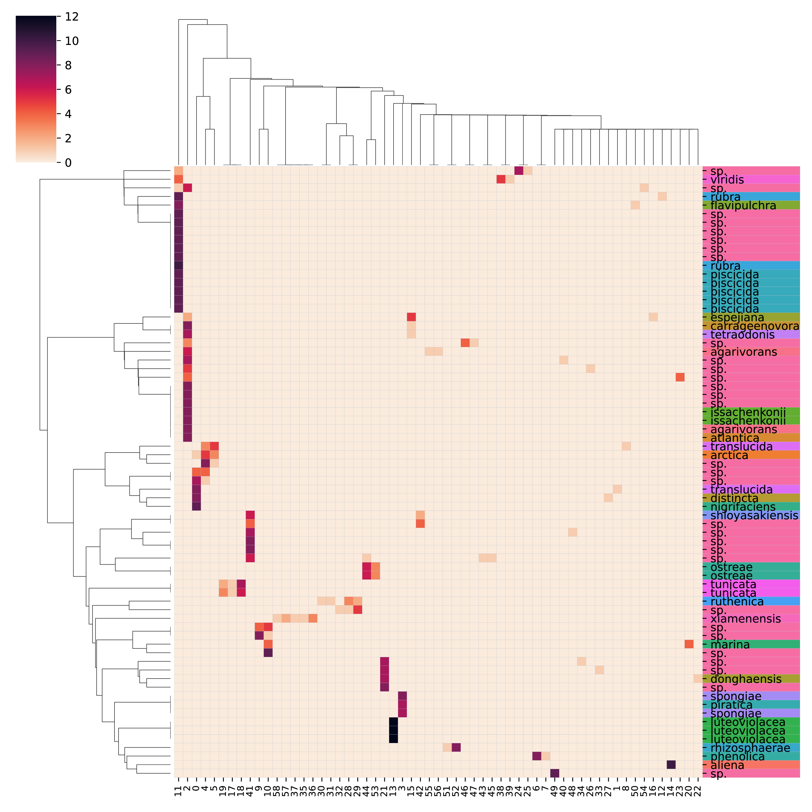
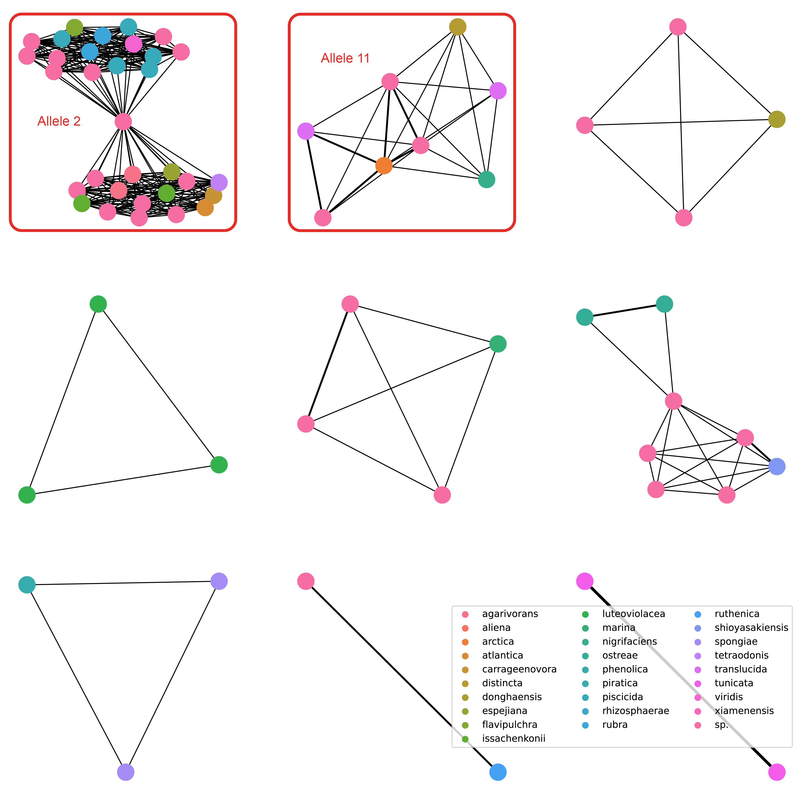

# RibDif2
**Update:** There is currently an issue with bedtools that is causing barrnap to not correctly extract rRNA sequences. You can just run the tool in `--whole-genome` mode and get the same results. I will look into fixing the default mode ASAP.

[RibDif2](https://github.com/Rob-murphys/ribdif) is designed to evaluate the usefulness of a given amplicon at differentiating within a genus or species.
It can also be used to aid in primer design for any primer set be it aimed at amplifying functional genes or used for species differentiation.
The tool will give you am amplification rate across the diversity of the selected genus so one can see how successful their primers are.

# Installation

## Setup conda

For this to work, you need [miniconda](https://docs.conda.io/en/latest/miniconda.html) to be installed on your system (in ubuntu if you are using WSL)

```
conda create --name ribdif2 python=3.11 -y
conda activate ribdif2
```

Ribdif is most easily installed with pip inside a virtual environment. Make sure your pip version is up to date!


`pip install git+https://github.com/Rob-murphys/ribdif.git`

Next we need to install some dependencies:

`conda install -c bioconda vsearch fasttree mafft barrnap pyani ncbi-genome-download -y`

Check your install:

`ribdif -h`

# Usage

## Running with default primers

`ribdif -g <some genus name>`

Use `-h` for full options list.

An example run with Ruegeria as the genus:

`ribdif -g Ruegeria`

You can also run with a species as well:

`ribdig -g "Mycoplasma bovis"`

## Running with custom primers

`ribdif -g <some genus name> -p /path/to/my_primer_file.txt`

### Primer file format

```
v3v4	CCTACGGGNGGCNGCAG	GACTACNNGGGTATCTAATCC	550
v1v9	AGRGTTYGATYMTGGCTCAG 	RGYTACCTTGTTACGACTT	1800
```
With the columns being: primer name | forward sequence | reverse sequence | expected amplicon size

## Running on custom genomes

The user may also provide their own database of genomes in fasta format within a single direcotry.

`ribdif -u my/directory/path`

Be warned that this mode of analysis disregards taxonomic inference and the user is responsible for the veracity of the provided database with regards to genome completeness and contamination.

## Output

RibDif2 generates a new directory within the specified output directory ("<current working directory>/results" by default) nameed after the genus in question.

```
<genus>
    ├── amplicons
        ├── <genus>-<primer name>-meta.tsv          # information about each leaf tip in the amplicon tree
        ├── <genus>-<primer name>.aln               # aligned amplicons from a given primer
        ├── <genus>-<primer name>.amplicons         # the amplicons generated by a given primer
        ├── <genus>-<primer name>.summary           # a summary of each amplicon generated (ID, originating sequence, position and length)
        ├── <genus>-<primer name>.tree              # tree of alligned amplicons for a given primer
        ├── <genus>-<primer name>.uc                # cluster file of amlicons for a given primer
        ├── <genus>-<primer name>_confusion.csv     # matrix of which genomes we can tell apart with these primers (a heatmap is made of this)
    │   └── <primer name>-clusters                  # directory of clusters generated from the amplicons of a givem primer
    ├── figures
    │   ├── <genus>-<primer name>_graphs.pdf    # visual network of which genomes and thereby species can be differentiated
    │   └── <genus>-<primer name>_heatmaps.pdf  # page 1 heatmap shows which genomes belong to which allele clusters and page 2 is the confusion matrix
    ├── full
    │   ├── <genus>.16S
    │   ├── <genus>.16sAln
    │   └── <genus>.16sTree
    ├── refseq
    │   └── bacteria
    │       ├── GCF_xxxxxxxxx.x
    │       │   ├── GCF_xxxxxxxxx.x_ASMxxxxv1_genomic.fna               # the original genome file, headers are renamed for downstream compatibility
    │       │   ├── GCF_xxxxxxxxx.x_ASMxxxxv1_genomic.fna.fai           # indexed fna file
    │       │   ├── GCF_xxxxxxxxx.x_ASMxxxxv1_genomic.fna.gz            # the gzipped original genome file
    │       │   ├── GCF_xxxxxxxxx.x_ASMxxxxv1_genomic.fna.rRNA          # rRNA file generated by barrnap
    │       │   ├── GCF_xxxxxxxxx.x_ASMxxxxv1_genomic.fna.rRNA.16S      # 16S genes taked from the .rRNA file
    │       │   ├── GCF_xxxxxxxxx.x_ASMxxxxv1_genomic.fna.rRNA.16sAln   # alligned .16S file (by mafft)
    │       │   ├── indiv_16S_dir                                       # folder for individual 16S filed if --ani is enabled
    │       │   ├──  ani                                                # files generated from pyani if --ani is enable
    │       │   └── MD5SUMS
    │       │   .
    │       │   .
    │       │   .
    │       └── GCF_xxxxxxxxx.x
    └── ribdif_logs
```
The most important files will be within the `<genus>` and then the `figures/` subdirectory.

If running as default on whole 16S genes extracted by barrnap you will see:
`<genus>_16S_summary.tsv` which contains a summary of all genomes and how many whole 16S genes were present
`<genus>_<primer name>-amp_summary.tsv` which contains a summery of each genomes and how many amplicons it produced

__OR__ if run with `--whole-genome` mode you will only see:
`<genus>_<primer name>-amp_summary.tsv` which contains a summary of all genomes and how many amplicons it produced

No matter your settings you will have `<genus>_<primer name>_overlap_report.txt` which show the text-based 
summary of your run that is also printed to console

Within `figures/` are the heatmaps and network graphs for a more visual representation of the results.

`full/` contains the concatinated full 16S sequences if not using `--whole-genome`.

The individually downloaded genomes are found in `refseq/<domain>`

### Figures

The provided figures include all those from version one plus the new additional network that illustrates shared alleles. 
For example a run using Pseudoalteromonas would produce the following (as of 07/07/2023)



We can see 58 unique alleles have been identified many of which are identicle in multiple genomes such as allele 2 which 
is shared across genome beloning to issachenkonii / espejiana / tetraodonis / carrageenovora / atlantica / sp. / agarivorans and allele 11 which is shared
across flavipulchra / sp. / rubra / piscicida / viridis. Hence these species cannot be separated using V3-V4 amplicon sequencing. Below
we can see these two indistinguishable clusters being represented in networks. Node represent a genome and edges represent shared alleles, 
with thickness representing the number of shared alleles.



The text-based output for the above V3-V4 would be as below. Showing 100% amplification rate of the primers.

```
Summary of Pseudoalteromonas differentiation by v3v4 amplicons:

                    Genomes downloaded: 71
                        With species name: 40
                        Without species name: 31
                        Unique species names: 27

                    Genomes amplified by v3v4: 71
                        With species name: 40
                        Without species name: 31
                        Unique species names: 27

                    39 of 71 (54.93%) genomes that amplified have multiple alleles.
                    20 of 27 (74.07%) species that experienced amplification have at least one overlap.

                    Total shannon diversity for v3v4 is: Was skipped

Group 0:        issachenkonii / espejiana / tetraodonis / carrageenovora / atlantica / sp. / agarivorans
Group 1:        flavipulchra / sp. / rubra / piscicida / viridis
Group 2:        nigrifaciens / distincta / sp. / translucida
Group 3:        sp. / arctica / translucida
Group 4:        arctica / translucida
Group 5:        sp. / shioyasakiensis
Group 6:        spongiae / piratica
Group 7:        sp. / donghaensis
Group 8:        sp. / ruthenica
Group 9:        sp. / marina
```
